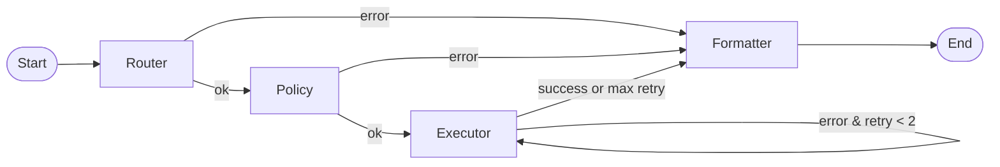
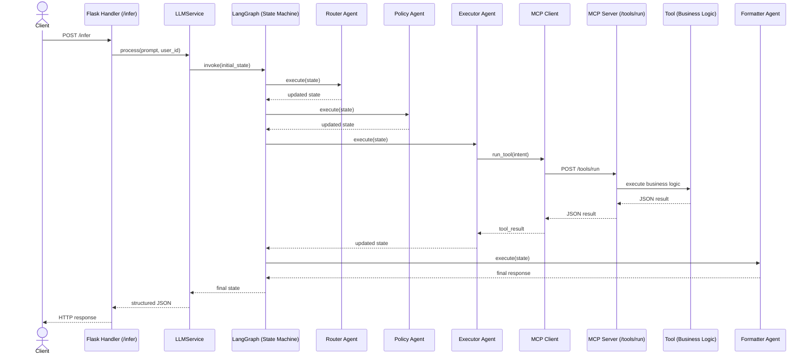

# GenAI Service

Flask-based service responsible for LLM inference and Agentic workflow orchestration with Model Context Protocol (MCP) tool integration.

## Purpose
- Receive prompts from the `backend-service` via the `/infer` endpoint
- Orchestrate multi-stage agentic workflows using LangGraph state machine
- Execute deterministic, role-based tool operations via MCP client
- Persist chat history and responses to repository
- Return structured JSON responses to the caller

## Tech Stack
- Python
- Flask
- LangGraph (for workflow graph)

## Architecture

### High-Level Components
The app runs as a single Flask service (port 5001) with:

**Blueprints:**
- `llm_blueprint` (handlers) — `/infer` endpoint for query processing
- `mcp_blueprint` (mcp_server) — `/tools/run` endpoint for tool execution

**Middleware:**
- `log_request` — request/response logging
- `authenticate` — sets user context (g.user_id)
- `register_error_handlers` — centralized error handling

**Core Services:**
- `LLMService` — orchestrates the StateGraph and manages chat persistence
- `ChatRepository` — in-memory chat storage (execution ID, user ID, prompts, responses)
- `VectorRepository` — vector embeddings for RAG (optional)

### Agent Orchestration (LangGraph Workflow)

**`agentic_mcp/` package:**
- `graph.py` — StateGraph definition with 4-stage pipeline
- `state.py` — AgentState TypedDict (execution_id, trace_id, role, query, intent, tool_result, retry_count, error, response)
- `agents.py` — Four agents: router, policy, executor, formatter
- `mcp_client.py` — HTTP client for `/tools/run` calls
- `mcp_server.py` — Flask blueprint exposing tool registry
- `tools.py` — TOOL_REGISTRY with eligibility_check & get_employee_age tools

### Agents

1. **Router Agent** → Analyzes query and selects appropriate tool (eligibility_check, get_employee_age)
2. **Policy Agent** → Validates role-based access control (admin/hr only)
3. **Executor Agent** → Calls MCP client → `/tools/run` with retry logic (max 2 retries on error)
4. **Formatter Agent** → Structures final response with metadata (execution_id, latency_ms, etc.). If any stage detects an error, flow short-circuits to the formatter agent with error details.

## Agentic Workflow (LangGraph State Machine)



## End-to-End Execution Flow



## Design Principles

- **Separation of Concerns** — HTTP handling, orchestration, and business logic are isolated.
- **Deterministic Execution Boundary** — AI reasoning is separated from tool execution via MCP.
- **Fail-Fast Workflow** — Router and Policy short-circuit on error.
- **Bounded Retries** — Executor retries are capped to prevent infinite loops.
- **Stateless Graph Execution** — Enables horizontal scalability.
- **Structured Observability** — execution_id and trace_id for tracing.

## Quickstart (Run Locally)

### Setup
```bash
cd genai-service
python -m venv venv

# Windows
venv\Scripts\activate

# macOS/Linux
source venv/bin/activate

# Install dependencies
pip install -r requirements.txt
```

### Environment Variables
Create a `.env` file in the `genai-service` directory:
```
OPENAI_API_KEY=your_api_key_here
```

### Run the Service
```bash
python app.py
```
The service starts on `http://localhost:5001`

## API Endpoints

### POST `/infer` — Main Query Processing
Receive a prompt, orchestrate the 4-stage workflow, return structured response.

**Request:**
```bash
curl -X POST http://localhost:5001/infer \
  -H "Content-Type: application/json" \
  -d '{"prompt":"Check eligibility for employee 123"}'
```

**Response:**
```json
{
  "response": {
    "execution_id": "uuid",
    "trace_id": "uuid",
    "tool_result": {
      "status": "success",
      "eligible": true,
      "reason": "Meets criteria"
    },
    "latency_ms": 45
  }
}
```

### POST `/tools/run` — MCP Tool Execution
Direct tool invocation endpoint (used internally by executor agent).

**Supported Tools:**
- `eligibility_check` — checks if employee meets age (≥21) and tenure (≥2 yrs) criteria
- `get_employee_age` — retrieves employee age from EMPLOYEE_DB

**Request:**
```bash
curl -X POST http://localhost:5001/tools/run \
  -H "Content-Type: application/json" \
  -d '{"tool":"eligibility_check","payload":{"query":"employee 123"}}'
```

**Response:**
```json
{
  "status": "success",
  "eligible": true,
  "reason": "Meets criteria"
}
```

### Mock Employee Database
Located in `agentic_mcp/tools.py`:
```
EMPLOYEE_DB = {
    "123": {"age": 30, "tenure": 5},
    "456": {"age": 20, "tenure": 1},
}
```

## Project Structure
```
genai-service/
├── app.py                      # Flask entry point, blueprints & middleware
├── llm_config.py              # LLMClient config (OpenAI API)
├── requirements.txt           # Python dependencies
├── agentic_mcp/
│   ├── graph.py              # LangGraph StateGraph + build_graph()
│   ├── state.py              # AgentState TypedDict definition
│   ├── agents.py             # 4 agents: router, policy, executor, formatter
│   ├── mcp_client.py         # HTTP client for /tools/run calls
│   ├── mcp_server.py         # Flask blueprint with /tools/run route
│   └── tools.py              # TOOL_REGISTRY, EMPLOYEE_DB, tool implementations
├── handlers/
│   └── llm_handler.py        # /infer blueprint & endpoint
├── middleware/
│   ├── logging_middleware.py # Request/response logging
│   ├── auth_middleware.py    # User context injection (g.user_id)
│   └── error_handler.py      # Global exception handlers
├── services/
│   └── llm_service.py        # LLMService (graph orchestration, persistence)
├── repositories/
│   ├── chat_repository.py    # In-memory chat storage (CRUD)
│   └── vector_repository.py  # Vector embeddings (optional RAG)
└── rag/
    └── rag_pipeline.py       # PDF extraction via pdfplumber
```

## Notes for Production
- The `router_agent` currently uses static tool selection; integrate with a real LLM (GPT-4, etc.) for dynamic routing.
- `ChatRepository` uses in-memory storage; replace with PostgreSQL or MongoDB for persistence.
- `agentic_mcp/tools.py` is fully deterministic for reproducible testing; add real business logic for production.
- Set `debug=False` and configure logging levels appropriately before deploying.
- CORS is currently restricted to `https://frontend.com`; update origins as needed.
