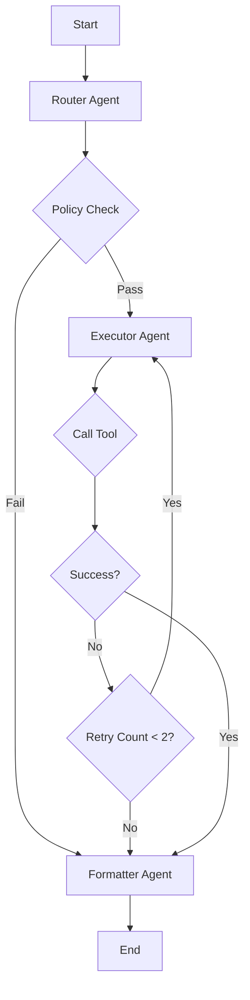

# GenAI Service

A Flask-based microservice that implements agentic AI workflows using LangGraph state machines and Model Context Protocol (MCP) for deterministic tool execution. The service orchestrates multi-agent systems for processing user queries with structured tool-based responses.

## Overview

This service provides AI-powered query processing through a sophisticated agentic architecture:
- **Multi-Agent Orchestration**: Router, Policy, Executor, and Formatter agents
- **State Machine Workflows**: Deterministic execution using LangGraph
- **Tool-Based Interactions**: MCP protocol for business logic execution
- **RAG Capabilities**: Document processing and context retrieval
- **Production-Ready Features**: Structured logging, error handling, observability

## Architecture

### Core Components

#### Agentic MCP Package (`agentic_mcp/`)
The heart of the service implementing the agentic workflow system:

**State Management (`state.py`)**:
```python
class AgentState(TypedDict):
    execution_id: str
    trace_id: str
    role: str
    query: str
    intent: Optional[str]
    selected_tool: Optional[str]
    tool_result: Optional[Dict]
    retry_count: int
    error: Optional[str]
    response: Optional[Dict]
    latency_ms: Optional[int]
```

**Workflow Graph (`graph.py`)**:
- **Router Agent**: Analyzes queries and selects appropriate tools
- **Policy Agent**: Enforces role-based access control (admin/hr only)
- **Executor Agent**: Executes tools with retry logic (max 2 retries)
- **Formatter Agent**: Structures final responses with metadata

**Agent Implementations (`agents.py`)**:
- Deterministic tool selection and execution
- Error handling and retry mechanisms
- Structured response formatting
- Performance monitoring with latency tracking

**MCP Integration (`mcp_client.py`, `mcp_server.py`)**:
- HTTP client for tool execution
- Flask blueprint exposing tool registry
- Standardized tool calling interface

**Tool Registry (`tools.py`)**:
- `eligibility_check`: Validates employee eligibility (age ≥21, tenure ≥2)
- `get_employee_age`: Retrieves employee age information
- Mock employee database for demonstration

#### Service Layer (`services/`)
**LLMService (`llm_service.py`)**:
- Orchestrates the complete agentic workflow
- Manages chat persistence and retrieval
- Integrates with repositories for data storage
- Provides unified interface for query processing

#### Repository Layer (`repositories/`)
**ChatRepository (`chat_repository.py`)**:
- In-memory storage for chat sessions
- CRUD operations for chat messages
- User-specific chat retrieval

**VectorRepository (`vector_repository.py`)**:
- Vector embeddings for RAG functionality
- Context retrieval from document collections

#### RAG Pipeline (`rag/`)
**RAGPipeline (`rag_pipeline.py`)**:
- PDF document processing using pdfplumber
- Text extraction and chunking
- Integration with vector storage

### Middleware Stack (`middleware/`)
- **LoggingMiddleware**: Request/response logging with correlation IDs
- **AuthMiddleware**: User context injection and authentication
- **ErrorHandler**: Global exception handling and structured error responses

### Flask Application (`app.py`)
- Blueprint registration for modular routing
- CORS configuration for cross-origin requests
- Middleware application order
- Development vs production configuration

## Agentic Workflow

### State Machine Flow


```mermaid
flowchart TD
    A[Start] --> R[Router Agent]
    R --> P{Policy Check}
    P -->|Fail| F[Formatter Agent]
    P -->|Pass| E[Executor Agent]
    E --> C{Call Tool}
    C --> S{Success?}
    S -->|No| RT{Retry Count < 2?}
    RT -->|Yes| E
    RT -->|No| F
    S -->|Yes| F
    F --> END[End]
```

### Agent Responsibilities

#### 1. Router Agent
- **Input**: Raw user query
- **Processing**: Tool selection logic (currently deterministic)
- **Output**: Selected tool intent
- **Error Handling**: Invalid tool selection

#### 2. Policy Agent
- **Input**: User role from request context
- **Processing**: Role-based access control
- **Output**: Authorization decision
- **Roles**: admin, hr (authorized), others (denied)

#### 3. Executor Agent
- **Input**: Selected tool and query
- **Processing**: MCP tool execution with retry logic
- **Output**: Tool results or error state
- **Retry Logic**: Maximum 2 retries on failure

#### 4. Formatter Agent
- **Input**: Final state (success or error)
- **Processing**: Structured response formatting
- **Output**: Standardized JSON response with metadata

## Technology Stack

- **Framework**: Flask 2.x
- **Workflow Engine**: LangGraph
- **Language**: Python 3.8+
- **HTTP Client**: Requests
- **Document Processing**: pdfplumber
- **Environment Management**: python-dotenv
- **CORS**: Flask-CORS

## Dependencies

```
flask==2.3.3
flask-cors==4.0.0
langgraph==0.0.32
requests==2.31.0
pdfplumber==0.10.3
python-dotenv==1.0.0
```

## Configuration

### Environment Variables
```bash
# Required for LLM operations (if integrated)
OPENAI_API_KEY=your_api_key_here

# Flask configuration
FLASK_ENV=development
FLASK_DEBUG=True
```

### Application Configuration
- **CORS Origins**: Restricted to `https://frontend.com`
- **Debug Mode**: Enabled for development
- **Port**: 5001 (configurable)

## API Endpoints

### POST `/infer` - Main Query Processing
Orchestrates the complete agentic workflow for user queries.

**Request**:
```bash
curl -X POST http://localhost:5001/infer \
  -H "Content-Type: application/json" \
  -d '{"prompt": "Check eligibility for employee 123"}'
```

**Response**:
```json
{
  "response": {
    "execution_id": "uuid-123",
    "status": "success",
    "data": {
      "status": "success",
      "eligible": true,
      "reason": "Meets criteria"
    },
    "metadata": {
      "intent": "eligibility_check",
      "role": "admin",
      "latency_ms": 45,
      "retry_count": 0,
      "trace_id": "uuid-456"
    }
  }
}
```

### POST `/tools/run` - Direct Tool Execution
Exposes the MCP tool registry for direct tool invocation.

**Supported Tools**:
- `eligibility_check`: Validates employee eligibility criteria
- `get_employee_age`: Retrieves employee age information

**Request**:
```bash
curl -X POST http://localhost:5001/tools/run \
  -H "Content-Type: application/json" \
  -d '{"tool": "eligibility_check", "payload": {"query": "employee 123"}}'
```

**Response**:
```json
{
  "status": "success",
  "eligible": true,
  "reason": "Meets criteria"
}
```

## Tool Registry

### Eligibility Check Tool
**Purpose**: Determine if an employee meets eligibility criteria
**Criteria**: Age ≥ 21 AND Tenure ≥ 2 years
**Input**: Employee ID (extracted from query)
**Output**: Eligibility status with reason

### Employee Age Tool
**Purpose**: Retrieve employee age information
**Input**: Employee ID (extracted from query)
**Output**: Employee age or null if not found

### Mock Database
```python
EMPLOYEE_DB = {
    "123": {"age": 30, "tenure": 5},  # Eligible
    "456": {"age": 20, "tenure": 1},  # Not eligible
}
```

## Data Flow

### End-to-End Request Processing

1. **Client Request** → POST `/infer` with user prompt
2. **Middleware** → Logging, authentication, user context injection
3. **LLMService** → Initialize workflow with execution/trace IDs
4. **LangGraph** → Execute agentic state machine:
   - Router → Select appropriate tool
   - Policy → Validate user permissions
   - Executor → Call MCP tool with retries
   - Formatter → Structure final response
5. **Repository** → Persist chat history
6. **Response** → Structured JSON with metadata

### Error Handling

- **Router Errors**: Invalid tool selection
- **Policy Errors**: Unauthorized access (non-admin/hr roles)
- **Executor Errors**: Tool execution failures with retry logic
- **Formatter Errors**: Structured error responses with trace information

## Development Setup

### Prerequisites
- Python 3.8 or higher
- pip package manager

### Installation
```bash
cd genai-service
python -m venv venv
source venv/bin/activate  # Windows: venv\Scripts\activate
pip install -r requirements.txt
```

### Environment Setup
```bash
# Create .env file
echo "OPENAI_API_KEY=your_key_here" > .env
```

### Running Locally
```bash
python app.py
# Service starts on http://localhost:5001
```

### Testing Tools
```bash
# Test eligibility check
curl -X POST http://localhost:5001/tools/run \
  -H "Content-Type: application/json" \
  -d '{"tool": "eligibility_check", "payload": {"query": "employee 123"}}'

# Test age retrieval
curl -X POST http://localhost:5001/tools/run \
  -H "Content-Type: application/json" \
  -d '{"tool": "get_employee_age", "payload": {"query": "employee 456"}}'
```

## Project Structure

```
genai-service/
├── app.py                      # Flask application entry point
├── llm_config.py              # LLM client configuration
├── requirements.txt           # Python dependencies
├── agentic_mcp/               # Core agentic workflow package
│   ├── __init__.py
│   ├── graph.py              # LangGraph state machine
│   ├── state.py              # AgentState type definitions
│   ├── agents.py             # Agent implementations
│   ├── mcp_client.py         # MCP HTTP client
│   ├── mcp_server.py        # MCP Flask blueprint
│   └── tools.py              # Tool registry and implementations
├── handlers/
│   └── llm_handler.py        # /infer endpoint blueprint
├── middleware/
│   ├── logging_middleware.py # Request logging
│   ├── auth_middleware.py    # Authentication
│   └── error_handler.py      # Error handling
├── services/
│   └── llm_service.py        # Workflow orchestration
├── repositories/
│   ├── chat_repository.py    # Chat persistence
│   └── vector_repository.py  # Vector storage
├── rag/
│   └── rag_pipeline.py       # Document processing
└── README.md
```

## Production Considerations

### Scalability
- **Stateless Design**: Each request is independent
- **Horizontal Scaling**: Multiple service instances possible
- **Async Processing**: Non-blocking tool execution

### Reliability
- **Retry Logic**: Bounded retries for transient failures
- **Error Isolation**: Failures contained within agent workflows
- **Structured Logging**: Comprehensive observability

### Security
- **Role-Based Access**: Policy agent enforces permissions
- **Input Validation**: Query parsing and sanitization
- **CORS Protection**: Restricted cross-origin access

### Monitoring
- **Execution Tracing**: Unique IDs for request tracking
- **Performance Metrics**: Latency measurement per operation
- **Error Reporting**: Structured error responses

This service demonstrates advanced AI orchestration patterns suitable for enterprise applications requiring deterministic, tool-based AI interactions.

    Graph->>Router: execute(state)
    Router-->>Graph: updated state

    Graph->>Policy: execute(state)
    Policy-->>Graph: updated state

    Graph->>Executor: execute(state)

    Executor->>MCPClient: run_tool(intent)
    MCPClient->>MCPServer: POST /tools/run
    MCPServer->>Tool: execute business logic
    Tool-->>MCPServer: JSON result
    MCPServer-->>MCPClient: JSON result
    MCPClient-->>Executor: tool_result

    Executor-->>Graph: updated state

    Graph->>Formatter: execute(state)
    Formatter-->>Graph: final response

    Graph-->>Service: final state
    Service-->>Handler: structured JSON
    Handler-->>Client: HTTP response
```

## Quickstart (Run Locally)

### Setup
```bash
cd genai-service
python -m venv venv

# Windows
venv\Scripts\activate

# macOS/Linux
source venv/bin/activate

# Install dependencies
pip install -r requirements.txt
```

### Environment Variables
Create a `.env` file in the `genai-service` directory:
```
OPENAI_API_KEY=your_api_key_here
```

### Run the Service
```bash
python app.py
```
The service starts on `http://localhost:5001`

## API Endpoints

### POST `/infer` — Main Query Processing
Receive a prompt, orchestrate the 4-stage workflow, return structured response.

**Request:**
```bash
curl -X POST http://localhost:5001/infer \
  -H "Content-Type: application/json" \
  -d '{"prompt":"Check eligibility for employee 123"}'
```

**Response:**
```json
{
  "response": {
    "execution_id": "uuid",
    "trace_id": "uuid",
    "tool_result": {
      "status": "success",
      "eligible": true,
      "reason": "Meets criteria"
    },
    "latency_ms": 45
  }
}
```

### POST `/tools/run` — MCP Tool Execution
Direct tool invocation endpoint (used internally by executor agent).

**Supported Tools:**
- `eligibility_check` — checks if employee meets age (≥21) and tenure (≥2 yrs) criteria
- `get_employee_age` — retrieves employee age from EMPLOYEE_DB

**Request:**
```bash
curl -X POST http://localhost:5001/tools/run \
  -H "Content-Type: application/json" \
  -d '{"tool":"eligibility_check","payload":{"query":"employee 123"}}'
```

**Response:**
```json
{
  "status": "success",
  "eligible": true,
  "reason": "Meets criteria"
}
```

### Mock Employee Database
Located in `agentic_mcp/tools.py`:
```
EMPLOYEE_DB = {
    "123": {"age": 30, "tenure": 5},
    "456": {"age": 20, "tenure": 1},
}
```

## Project Structure
```
genai-service/
├── app.py                      # Flask entry point, blueprints & middleware
├── llm_config.py              # LLMClient config (OpenAI API)
├── requirements.txt           # Python dependencies
├── agentic_mcp/
│   ├── graph.py              # LangGraph StateGraph + build_graph()
│   ├── state.py              # AgentState TypedDict definition
│   ├── agents.py             # 4 agents: router, policy, executor, formatter
│   ├── mcp_client.py         # HTTP client for /tools/run calls
│   ├── mcp_server.py         # Flask blueprint with /tools/run route
│   └── tools.py              # TOOL_REGISTRY, EMPLOYEE_DB, tool implementations
├── handlers/
│   └── llm_handler.py        # /infer blueprint & endpoint
├── middleware/
│   ├── logging_middleware.py # Request/response logging
│   ├── auth_middleware.py    # User context injection (g.user_id)
│   └── error_handler.py      # Global exception handlers
├── services/
│   └── llm_service.py        # LLMService (graph orchestration, persistence)
├── repositories/
│   ├── chat_repository.py    # In-memory chat storage (CRUD)
│   └── vector_repository.py  # Vector embeddings (optional RAG)
└── rag/
    └── rag_pipeline.py       # PDF extraction via pdfplumber
```

## Production Considerations

### Scalability
- **Stateless Design**: Each request is independent
- **Horizontal Scaling**: Multiple service instances possible
- **Async Processing**: Non-blocking tool execution

### Reliability
- **Retry Logic**: Bounded retries for transient failures
- **Error Isolation**: Failures contained within agent workflows
- **Structured Logging**: Comprehensive observability

### Security
- **Role-Based Access**: Policy agent enforces permissions
- **Input Validation**: Query parsing and sanitization
- **CORS Protection**: Restricted cross-origin access

### Monitoring
- **Execution Tracing**: Unique IDs for request tracking
- **Performance Metrics**: Latency measurement per operation
- **Error Reporting**: Structured error responses

This service demonstrates advanced AI orchestration patterns suitable for enterprise applications requiring deterministic, tool-based AI interactions.
